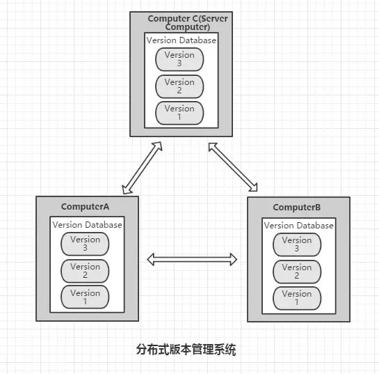
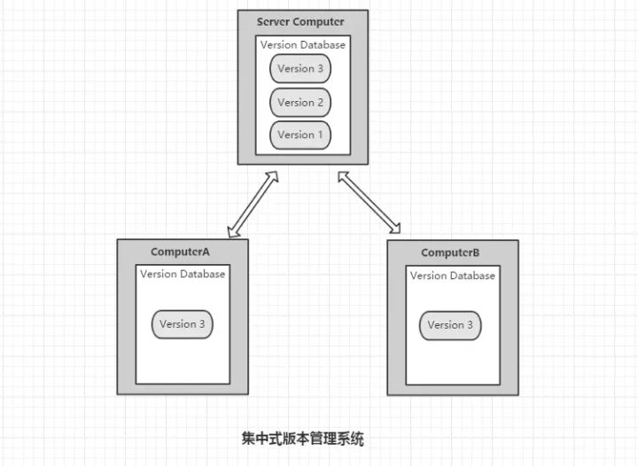

[TOC]

# 安装和使用

## linux安装

### 包管理器安装(推荐)

```bash
$sudo apt install git git-doc
```

### 编译安装(略)

### git版本库安装(已有git)

1. 克隆git到本地

   ```bash
   $git clone git://git.kernel.org/pub/scm/git/git.git
   $cd git
   ```

2. 若已克隆过，获取最新版本
   $git fetch

3. 清理上次编译的遗留文件

   ```bash
   $git clean-fdx
   $git reset--hard
   ```

4. 查看git里程碑

   ```bash
   $git tag		
   ```

5. 检出版本代码	

   ```bash
   $git checkout v1.7.4.1
   ```

6. 安装

   > 安装到/usr/local   

   ```bash
   $make prefix=/usr/local all doc info
   $sudo make prefix=/usr/local install\
   install-doc install-html install-info
   ```

    > 安装不同版本的git脚本
    >
    > ```shell
    > #!/bin/sh
    > for ver in\
    > v1.5.0\
    > v1.7.3.5\
    > v1.7.4.1\
    > ；do
    > echo "Begin install Git$ver."；
    > git reset--hard
    > git clean-fdx
    > git checkout$ver||{
    > echo "Checkout git$ver failed."；exit 1
    > }
    > make prefix=/opt/git/$ver all＆＆\
    > sudo make prefix=/opt/git/$ver install||{
    > echo "Install git$ver failed."；exit 1
    > }
    > echo "Installed Git$ver."
    > done
    > ```

7. 命令补齐

   包管理器安装的一般都配置好了命令自动补齐(tab键),手动安装的需要配置

   （1）将Git源码包中的命令补齐脚本复制到bash-completion对应的目录中。

------

   ```bash
   $cp contrib/completion/git-completion.bash\
   /etc/bash_completion.d/
   ```

------

   （2）重新加载自动补齐脚本，使之在当前的shell中生效。

------

   ```bash
   $./etc/bash_completion
   ```

------

   命令补齐

   如果通过包管理器方式安装Git，一般都已经为Git配置好了自动补齐，但是如果是以源码编译的方式安装Git，就需要为命令补齐多做些工作，具体操作过程如下。

   （1）将Git源码包中的命令补齐脚本复制到bash-completion对应的目录中。

------

   ```bash
   $cp contrib/completion/git-completion.bash\
   /etc/bash_completion.d/
   ```

------

   （2）重新加载自动补齐脚本，使之在当前的shell中生效。

------

   ```bash
   $./etc/bash_completion
   ```

   （3）为了能够在终端开启时自动加载bash_completion脚本，需要在系统配置文件/etc/profile[^1]及本地配置文件～/.bashrc[^2]中添加下面的内容。

------

   ```bash
   if[-f/etc/bash_completion];then
   ./etc/bash_completion
   fi
   ```

------

[^1]: 配置文件/etc/profile及～/.bash_profile、～/.profile等作用于交互式登录shell。
[^2]: 配置文件～/.bashrc作用于交互式非登录shell，如screen或byobu中建立的新的shell窗口。

8. 中文支持 

   1. UTF-8字符集

      linux一般都是UTF-8字符集，Git就是linus开发的，自然不存在问题。在提交时可以使用中文，并且能正常显示，但是默认设置里文件名的中文不能在工作区状态输出时正确显示，而是八进制的字符编码(未测试)

      ```bash
      $git status-s
      ?? "\350\257\264\346\230\216.txt"
      $printf "\350\257\264\346\230\216.txt\n"
      说明.txt
      ```

      通过将Git配置变量core.quotepath设置为false，就可以解决中文文件名在这些Git命令输出中的显示问题。

      ```bash
      $git config--global core.quotepath false
      $git status-s
      ??说明.txt		
      ```

   2. GBK字符集

      如果Linux平台采用非UTF-8的字符集，例如，用zh_CN.GBK字符集编码（有人这么做吗？），就要另外再做些工作了。

      将显示提交说明所使用的字符集设置为gbk，这样使用git log查看提交说明时才能够正确显示其中的中文。

      ------

      ```bash
      $git config--global i18n.logOutputEncoding gbk
      ```

      ------

      设置录入提交说明时所使用的字符集，以便在commit对象中正确标注字符集。Git在提交时并不会对提交说明进行从GBK字符集到UTF-8的转换，但是可以在提交说明中标注所使用的字符集，因此在非UTF-8字符集的平台中录入中文时需要用下面的指令设置录入提交说明的字符集，以便在commit对象中嵌入正确的编码说明。

      ------

      ```bash
      $git config--global i18n.commitEncoding gbk
      ```

      ------

## Git初始化

1. 设置当前用户姓名和邮箱

   ```bash
   $git config --global user.name "QueenOfBugs"
   $git config --global user.email wj915614874@163.com
   ```

   :question:这个用户名和邮箱设置有什么用

   ​    

2. (可选)设置Git命令别名

   ```bash
   $sudo git config --system alias.st status
   $sudo git config --system alias.ci commit
   $sudo git config --system alias.co checkout
   $sudo git config --system alias.br branch
   ```

   不用sudo就只为当前user配置别名

3. (可选)开启颜色显示

   ```bash
   $git config --global color.ui true
   ```

4. 新建工作目录并创建版本库

   1. 新建工作目录

      ```bash
      $cd /home/
      $mkdir Workspace/demo
      $cd Workspace/demo/
      ```

   2. 初始化完成会创建隐藏目录.git

      ```bash
      $git init
      $ls -aF
      ./../.git/
      ```

   ​      .git是git版本库(repository)
   ​      demo目录是工作区

   3. 添加文件

      ```bash
      $echo "hello">welcome.txt
      $git add welcome.txt
      ```
		将文件添加到版本库

   4. 第一次提交

      ```bash
      $git commit -m "initialized"
      ```

      提交到版本库,git 不允许提交空的说明,需要带-m,不带就会自动打开文件编辑器让你编辑说明.这提交的是本地版本库.

## Git相关疑问

### 1.为什么会有.git文件夹
集中式版本控制系统(eg. SVN)一个项目对应只有一个版本库所有成员都需要向这个版本库所在的服务器进行提交;

分布式版本控制系统(eg. GIT)每个人都拥有一个完整的版本库，查看提交日志、提交、创建里程碑和分支、合并分支、回退等所有操作都直接在本地完成而不需要网络连接




分布式版本控制系统的版本库都在工作目录的根目录下(git的就是根目录下的.git文件夹)


