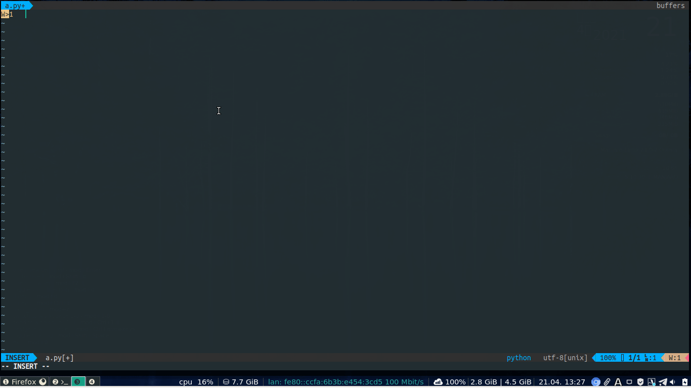
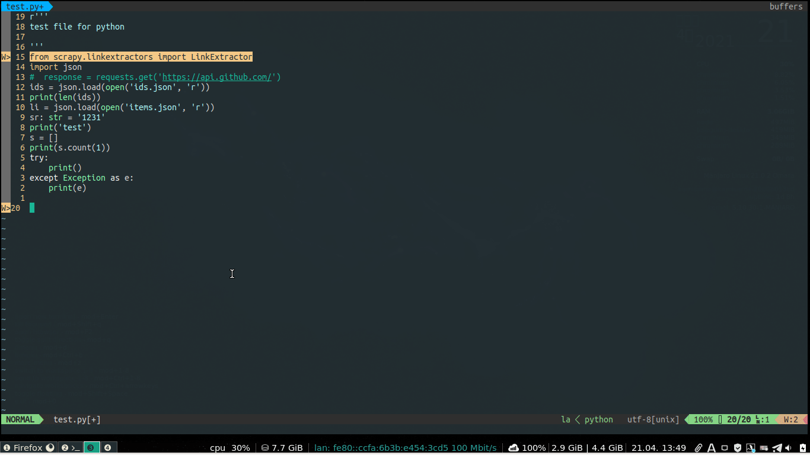

# Vim配置python开发环境

time:2021-04-21

功能:代码提示,代码补全,语法检查,snippet补全

系统和软件版本:
```
$ vim --version
VIM - Vi IMproved 8.2 (2019 Dec 12, compiled Mar 26 2021 00:21:09)
Included patches: 1-2653
Compiled by Arch Linux

$ uname -a
Linux kamisama-20e0a013cd 5.10.30-1-MANJARO #1 SMP Wed Apr 14 08:07:27 UTC 2021 x86_64 GNU/Linux
```

## 插件管理器Vim-Plug

- 通过命令行直接安装
Unix:
> 这种方式可能需要代理才能使用，下载的网址貌似被墙,至少在我写这条记录的时候下载不了,墙对于gayhub的策略真是搞不懂
```
$ curl -fLo ~/.vim/autoload/plug.vim --create-dirs \
    https://raw.githubusercontent.com/junegunn/vim-plug/master/plug.vim
```
> 由于这种方式下载不了，所以官网推荐的自动安装的方法不适用
- 手动下载安装:
将命令行里的网址复制到浏览器，访问并复制网页内容，保存为plug.vim文件，放置到`.vim/autoload/`目录

## 插件安装(加载)

~/.vimrc:
```vim
call plug#begin('~/.vim/plugged')
Plug 'prabirshrestha/vim-lsp'
Plug 'mattn/vim-lsp-settings'
Plug 'prabirshrestha/asyncomplete.vim'
Plug 'prabirshrestha/asyncomplete-lsp.vim'
Plug 'prabirshrestha/asyncomplete-ultisnips.vim'
Plug 'honza/vim-snippets'
Plug 'SirVer/ultisnips'
call plug#end()
```
编辑完后保存`:w`,执行`:source %`重新加载vimrc文件,执行`:PlugInstall`下载插件
## 插件配置

~/.vimrc:(配置放在插件加载之后)
```
if &runtimepath =~ 'asyncomplete'
" inoremap <expr> <Tab>   pumvisible() ? "\<C-n>" : "\<Tab>"
" inoremap <expr> <S-Tab> pumvisible() ? "\<C-p>" : "\<S-Tab>"
" inoremap <expr> <cr>    pumvisible() ? asyncomplete#close_popup() : "\<cr>"
inoremap <expr> <Tab> pumvisible() ? "\<C-n>" : "\<Tab>"
inoremap <expr> <S-Tab> pumvisible() ? "\<C-p>" : "\<S-Tab>"
inoremap <expr> <cr>    pumvisible() ? "\<C-y>" : "\<cr>"
imap <c-space> <Plug>(asyncomplete_force_refresh)
endif

if &runtimepath =~ 'asyncomplete-ultisnips'
    if has('python3')
    " let g:UltiSnipsExpandTrigger="<cr>"
    " ctrl + e 触发snippet
    let g:UltiSnipsExpandTrigger="<c-e>"
    let g:UltiSnipsJumpForwardTrigger="<c-b>"
    let g:UltiSnipsJumpBackwardTrigger="<c-z>"
    let g:UltiSnipsEditSplit="vertical"
    call asyncomplete#register_source(asyncomplete#sources#ultisnips#get_source_options({
        \ 'name': 'ultisnips',
        \ 'allowlist': ['*'],
        \ 'completor': function('asyncomplete#sources#ultisnips#completor'),
        \ }))
    endif
endif
if &runtimepath =~ 'vim-lsp'
nmap gd :LspDefinition<cr>
nmap <leader>f :LspDocumentFormat<cr>
let g:lsp_diagnostics_float_cursor=1
let g:lsp_diagnostics_virtual_text_enabled=1
endif
```
上面的配置就能实现类似pycharm的代码补全功能了

## 插件详解:

- vim-lsp:vim的language server protocol插件
- vim-lsp-setting:方便配置vim-lsp的插件
上面两个插件安装完后打开一个py文件，就会提示安装语言服务器,选择yes；或者执行`:LspInstallServer pyls-all`,pyls-all可以换成其他，在`LspInstallServer`后按`<TAB>`就会切换可用的语言服务器

- asyncomplete:自动补全插件. 
 
安装lsp后可以直接用lsp的补全功能，但是用的不是很方便，需要阅读文档后自己定制，没时间和耐心的就不合适了，所以使用自动补全插件
- asyncomplete-lsp:让asyncomplete使用lsp的补全

- vim-snippets:大量的snippet代码，不提供补全，所以需要补全引擎，例如:ultisnips
- ultisnips:snippet的补全引擎
- asyncomplete-ultisnips:将ultisnips的补全集成到asyncomplete

## 效果图



